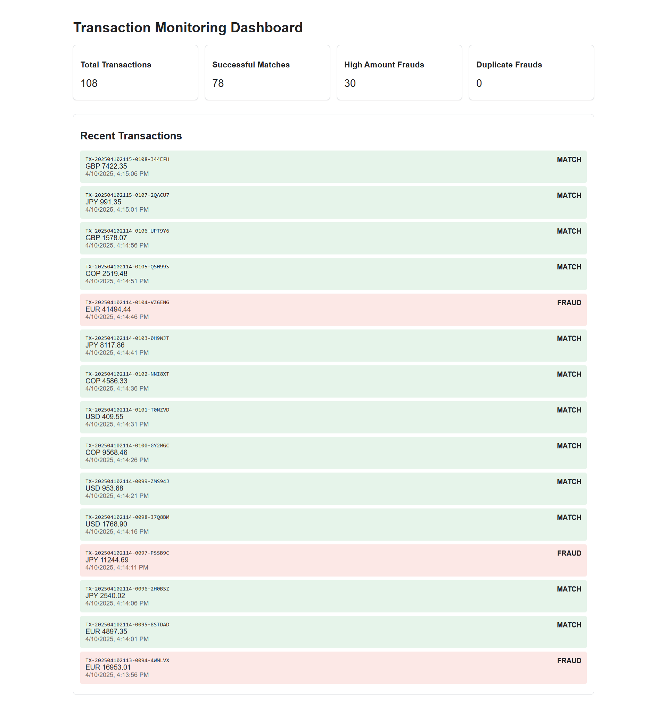
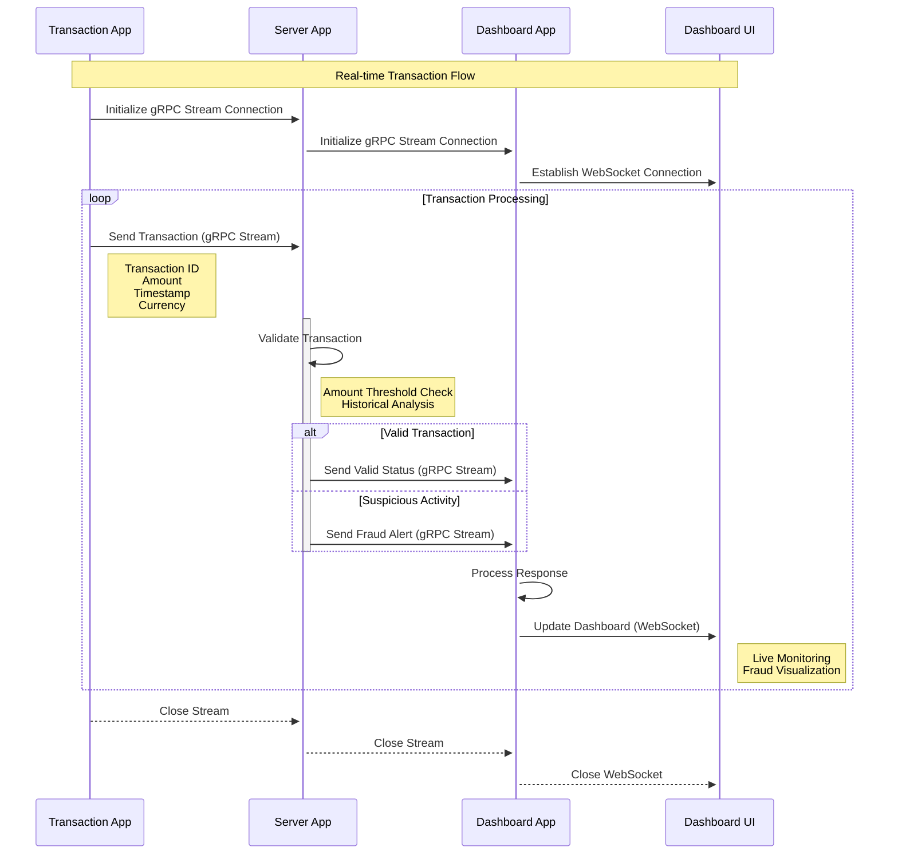
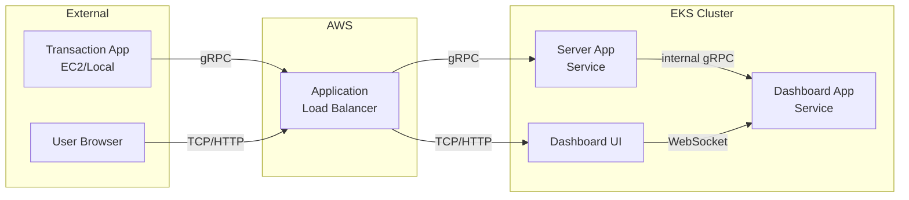
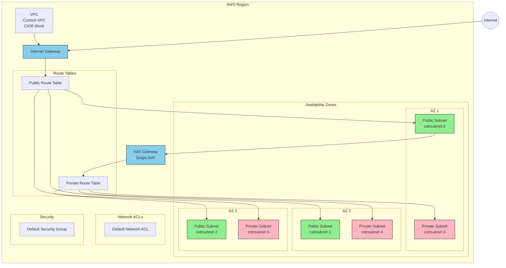
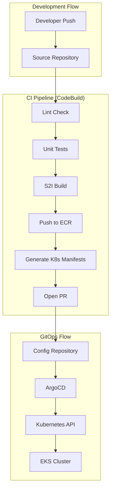
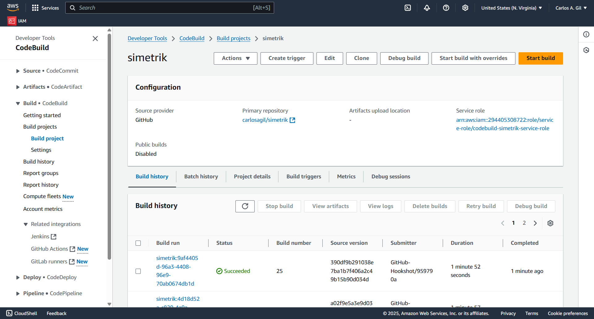

# Concept: Real-Time Transaction Reconciliation Streaming Service

## TL;DR
A cloud-native financial transaction validation system built with three microservices: a Python-based Transaction App that generates mock bank transactions, a Server App handling real-time validation and fraud detection through gRPC streaming, and a JavaScript Dashboard App providing live tranasaction monitoring and fraud alerts via WebSocket. The system is deployed on AWS EKS using GitOps practices with ArgoCD, featuring comprehensive monitoring through Prometheus and Grafana. The architecture emphasizes high performance, real-time processing, and secure communication between services using gRPC and WebSocket protocols.

- [Concept: Real-Time Transaction Reconciliation Streaming Service](#concept-real-time-transaction-reconciliation-streaming-service)
  - [TL;DR](#tldr)
  - [1. Introduction](#1-introduction)
  - [2. Overview of Data Flow](#2-overview-of-data-flow)
    - [Sequence Diagram](#sequence-diagram)
  - [3. Architecture Overview](#3-architecture-overview)
    - [Infrastructure Components](#infrastructure-components)
      - [External Service Layer](#external-service-layer)
      - [Kubernetes Cluster (EKS)](#kubernetes-cluster-eks)
  - [Communication Flow](#communication-flow)
    - [Communication Patterns](#communication-patterns)
    - [Network Layer](#network-layer)
  - [GitOps Workflow](#gitops-workflow)
    - [Source Repository](#source-repository)
    - [Config Repository](#config-repository)
  - [Workflow Diagram](#workflow-diagram)
    - [Pipeline Stages](#pipeline-stages)
  - [Project Improvements](#project-improvements)
    - [Error Handling \& Monitoring](#error-handling--monitoring)
    - [Security](#security)
    - [Karpenter Implementation](#karpenter-implementation)
    - [Monitoring Stack](#monitoring-stack)
    - [Service Mesh](#service-mesh)

## 1. Introduction
   
In this project, I built a real-time system to simulate and validate bank transactions using gRPC for communication. The idea was to create an end-to-end demonstration of microservices communication that mirrors real-world financial automation and fraud detection processes—a concept closely aligned with Simetrik’s business model. The project consists of three main applications:

Transaction App (Python): Mocks bank transactions.

Server App (Python): Receives transactions, performs validations, and detects potential fraud.

Dashboard App (JS): Receives validated responses and presents the data on a central dashboard.

## 2. Overview of Data Flow

**Transaction App:**
I developed a Python application that generates simulated bank transactions. Each transaction is packaged as a gRPC message and sent to the Server App.

- Implements a gRPC client that connects to the Server App
- Generates randomized but transaction data including:
  * Transaction ID
  * Amount
  * Timestamp
  * Currency

**Server App:**
The Server (also built with gRPC) receives transaction messages and processes each one. It runs a series of validations over the transaction data to determine whether there is any suspicious activity indicative of fraud. After processing, the server sends back a response that includes the status of the transaction (e.g., match, flagged for fraud)

The core processing component of the system, featuring:

- Bi-directional gRPC streaming implementation
- Advanced transaction validation logic including:
  * Amount threshold validation
  * Historical transaction analysis

**Dashboard App:**
I implemented the Dashboard as a JavaScript-based gRPC server. It receives the processed responses from the Server App and forwards the data to a central dashboard interface. This allows real-time monitoring and visualization of transactions and any flagged fraud.

A web-based monitoring solution that includes:

- Node.js-based gRPC server implementation
- Real-time data processing and event streaming
- dashboard interface featuring:
  * Live transaction monitoring
  * Fraud alert visualization
- WebSocket integration for real-time updates to the UI

The communication between these components is entirely handled via gRPC, ensuring high performance, efficient streaming, and a well-defined contract between the different services.

### Sequence Diagram

## 3. Architecture Overview

The system follows a cloud-native architecture leveraging AWS services and Kubernetes for deployment, with gRPC as the primary communication protocol between services.

### Infrastructure Components

#### External Service Layer
- **Transaction Application**
  - Deployed on EC2 instance or runs locally
  - Acts as a gRPC client
  - Connects to the cluster through AWS Application Load Balancer (ALB)

#### Kubernetes Cluster (EKS)
- **Server Application**
  - Deployed as a Kubernetes service
  - Exposes gRPC endpoints through ALB
  - Handles transaction processing and validation
  - Acts as both gRPC server (for Transaction App) and client (for Dashboard)

- **Dashboard Application**
  - Deployed as a Kubernetes service
  - Internal to the cluster
  - Receives processed data via gRPC
  - Serves real-time updates through WebSocket

## Communication Flow

### Communication Patterns
- Transaction Flow

  - Transaction App → ALB → Server App (gRPC)

  - Server App → Dashboard App (internal gRPC)

- User Interface Flow

  - User Browser → ALB → Dashboard UI (HTTP/TCP)

  - Dashboard UI → Dashboard App (WebSocket)

  - Real-time updates pushed through WebSocket connection

### Network Layer

1. External Access

   - ALB handles both gRPC and HTTP traffic

   - Separate listeners for:

        gRPC (Transaction App communication)

        HTTP (Dashboard UI access)

2. Internal Communication

   - gRPC between Server and Dashboard services

   - WebSocket for real-time updates to UI

   - Service-to-service communication within EKS

3. Overview

   - VPC Structure
     - Main VPC with specified CIDR block
     - 3 Availability Zones

   - Subnet Layout
       - Public Subnets (green)
       - Private Subnets (pink)
       - CIDR block allocation using cidrsubnet function

   - Gateways
       - Internet Gateway (IGW)
       - Single NAT Gateway in first public subnet

   - Networking Components
       - Default Network ACL
       - Route Tables (Public and Private)
       - Default Security Group

   - Routing
       - Public subnets route to IGW
       - Private subnets route through NAT Gateway
       - Internet connectivity flow

   - Special Features
       - Kubernetes tags for ELB and internal-ELB
       - Karpenter discovery tags for private subnets
       - Single NAT Gateway configuration

   - Color Coding
        The color coding helps distinguish between:
        - Public resources (green)
        - Private resources (pink)
        - Gateway components (blue)

## GitOps Workflow

My GitOps implementation follows a two-repository pattern with automated CI/CD pipeline using AWS CodeBuild and ArgoCD for deployment.

### Source Repository
- **Repository**: `github.com/carlosagil/simetrik`
- **Contains**:
  - Application source code
  - Dockerfile
  - Unit tests
  - CI/CD pipeline configurations
  - Source-to-Image (S2I) configurations

### Config Repository
- **Repository**: `github.com/carlosagil/simetrik-config`
- **Contains**:
  - Kubernetes manifests
  - Environment-specific configurations
  - ArgoCD application definitions

## Workflow Diagram

### Pipeline Stages

1. CI Pipeline (CodeBuild)
- **Lint Check**: Ensures code quality and style standards
- **Unit Tests**: Validates code functionality
- **S2I Build**: Creates container images using Source-to-Image
- **ECR Push**: Publishes images to Amazon Elastic Container Registry
- **Manifest Generation**: Creates/updates Kubernetes manifests
- **PR Creation**: Opens pull request to config repository

2. GitOps Deployment (ArgoCD)
- **Config Sync**: Monitors config repository for changes
- **Manifest Application**: Applies configurations to cluster
- **State Reconciliation**: Ensures desired state matches actual state
- **Automated Rollback**: Reverts failed deployments automatically

## Project Improvements

### Error Handling & Monitoring
  - Implement structured error handling
  - Add retry logic for dashboard service
  - Define error types and codes

### Security
  - Implement secure gRPC channels
  - Generate TLS certificates
  - Configure mutual TLS (mTLS)
  - Add certificate management

### Karpenter Implementation
  - Set up Karpenter autoscaling
  - Configure node provisioners
  - Define scaling policies
  - Set resource limits
  - Implement cost optimization

### Monitoring Stack
  - Deploy Prometheus
  - Set up Prometheus Operator
  - Configure service monitors
  - Install Grafana
  - Create monitoring dashboards

### Service Mesh
  - Implement service mesh
  - Traffic management
